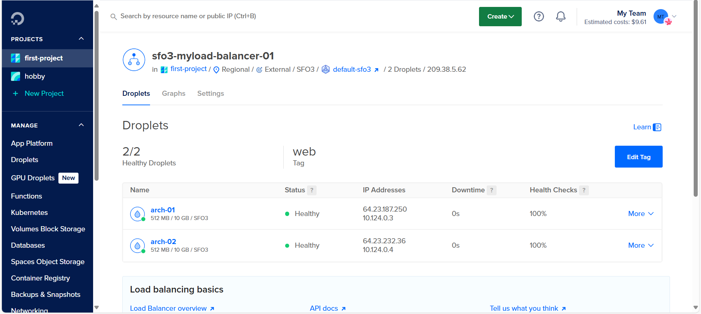
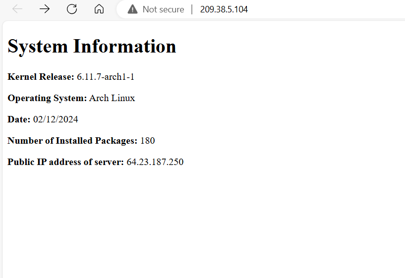
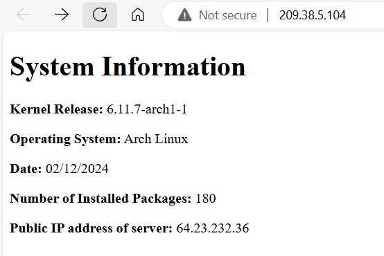

## Overview 
This tutorial explains how to set up a Bash script that generates a static index.html file with system information daily at 05:00, along with a route to display files in the `document` folder. It uses a systemd service and timer on the Arch Linux droplet with the Nginx web server and hosting it on two servers with a load balancer to handle any request. 

## Features
- Automates daily generation of a static `index.html` with system information.
- Uses `systemd` service and timer for scheduling.
- Displays the HTML file through an Nginx web server.
- Display files in webserver via route /documents  ``
- Uses a load balancer to handle request to the servers 
- Use UFW to secure the server.
## Requirements

1. DigitalOcean account
2. Arch Linux image (cloudimg and ending with .qcow2)
3. SSH key pair 

link to download image: [Package Registry · Arch Linux / arch-boxes · GitLab](https://gitlab.archlinux.org/archlinux/arch-boxes/-/packages)
## Getting Started
### Create Servers (Droplets)

**what is a Droplet**
Droplets are Linux based virtual machines(VMs) that run on top of virtualized hardware. Each Droplet you create is a new server you can use. 

----
### Step to create a Droplet

In this section, we will create servers (droplets) on DigitalOcean.
1. Go to [https://www.digitalocean.com/](https://www.digitalocean.com/).
2. Log in or sign up.
3. Click **Create**:  
    
4. In the drop-down menu, select **Droplet**.
5. Configure the following settings:
    1. **Region**: San Francisco.
    2. **Datacenter**: SFO3.
    3. **Choose Image**: Select **Custom** and choose the image you downloaded earlier.
    4. **Choose Size**:
        - **Droplet Type**: Basic.
        - **CPU Option**: Regular with $4 per month.
    5. **Authentication Method**: Select **your_ssh_key**.
    6. **Quantity**: 2.
    7. **Tag**: web.
**Note:** Keep the settings unchanged unless instructed otherwise in the steps.

---
### Create Load Balancer

**What is a Load Balancer?**  
A load balancer is hardware or software that distributes incoming requests from users across multiple servers. The load balancer determines which server to send a request to based on the server's health and current traffic load.

---
### Steps to Create a Load Balancer on DigitalOcean
1. On DigitalOcean, click **Create**:  
    
2. In the drop-down menu, select **Load Balancer**.
3. Configure the following settings:
    1. **Load Balancer Type**: Region.
    2. **Datacenter Region**: San Francisco (the region where your droplet is created).
    3. **Network Visibility**: External (Public).
    4. **Scaling Configuration**: Set the number of nodes to 2.
    5. **Connect Droplets**: Select the tag **web**.
    6. **Forwarding Rules**: HTTP port 80 → HTTP port 80.
    
    **Note:** Keep the settings unchanged unless instructed otherwise in these steps.
---

**Done!** You have successfully created a load balancer that connects to both of your servers and listens on port 80.

what you have done so far : 
```

	     [INTERNET]
		     |
      [LOAD BALANCER]
             |
   ---------------------
   |                   |
[SERVER 1]         [SERVER 2]

```


**Now**, if you look at the status of the load balancer, you will see that it shows both of your servers are down, even though your servers are running.

**The reason is** that the load balancer is listening on port 80, but your droplet is not configured to serve any content on port 80


---
### Set up droplet
1. SSH to your arch linux droplet with your ssh key
```bash
ssh -i <path_to_privatekey> arch@ip_of_your_droplet
```
2. update package manager database
```bash
sudo pacman -Syu
```
3. reboot droplet
```bash
sudo reboot
```
4. install package `git`
```bash
sudo pacman -S git
```
5. install package `nginx`
```bash
sudo pacman -S nginx
```
6. install package `UFW`
```bash
sudo pacman -S ufw
```
7. clone this git repository
```bash
git clone https://github.com/GetMeoutt/linux_assignment3P2.git
```
8. `cd` to the folder
```bash
cd linux_assignment3P2
```

---
### Set up `webgen` user
**What is `webgen` user**
**`webgen`** is a system user that we are going to create to handle tasks related to generating HTML pages and controlling Nginx. This user is intended to isolate tasks and permissions, reducing the risk of accidents and errors.


after configuring everything, user `webgen`'s home directory should have the following structure: 
```text
/var/lib/webgen/
|
|_____/bin
|       └-generate_index
|_____/HTML
|        └-index
|_____/documents
        └-file1
        └-file2
               
```

- `bin` folder is going to be the place where we put the script `generate_index` and execute it from `.service` file (systemd)
- `HTML` is a folder that stores the HTML file that is created by `generate_index`
- `documents` is a folder that stores the files that we want to display on webserver 
---

### Step to create `webgen`
1. create user 
```bash
sudo useradd -r -d /var/lib/webgen -m webgen -s /usr/bin/nologin
```
2. create folder `bin` , `HTML` and `document`
```bash
sudo mkdir /var/lib/webgen/bin /var/lib/webgen/HTML /var/lib/webgen/documents
```

after you finish the step above you should be able to see the two folders inside `webgen`'s home directory. Now we are going to put script `generate-index` in the folder `bin` because the user `webgen` is responsible for generating HTML

3. move the `generate-index` to folder in 
```bash
sudo mv generate_index /var/lib/webgen/bin
```

4. give the execute permission to the script
```bash
sudo chmod +x /var/lib/webgen/bin/generate_index
```
5. create files in folder documents and append any content inside
```bash
echo hello > /var/lib/webgen/documents/file1
echo hello > /var/lib/webgen/documents/file2
```

6. change the permission of the folder (including anything inside to `webgen`)
```bash
sudo chown -R webgen:webgen /var/lib/webgen
```


#### Reference
[https://www.techtarget.com/searchsecurity/definition/principle-of-least-privilege-POLP](https://www.techtarget.com/searchsecurity/definition/principle-of-least-privilege-POLP)

---

now, after we finish setting up the user `webgen`, we are going to configure the process of running `generate-index` (to generate html) by using systemd


---
### Set up systemd 
**What is systemd?**
is a software that provides a system and service manager that runs on PID 1 and starts the rest of the system.

---
### Step to setup generate-index with systemd 
In this step, we are going to set up systemd with the config file provided from this repository (.service and .timer) to make the server generate HTML. 

1. move generate-index.service to `/etc/systemd/system`
```bash
sudo mv generate-index.service /etc/systemd/system
```
2. start the service 
```bash
sudo systemctl start generate-index
```
3. enable service, to ensure it starts when the server boots
```bash
sudo systemctl enable generate-index
```

After starting `generate-index`, it will create an HTML file in the `webgen` home directory. Now, we are going to move the `.timer` to the system to make it generate (or update) the HTML file every day at 5 AM.

4. move `generate-index.timer` to `/etc/systemd/system`
```bash
sudo mv generate-index.timer /etc/systemd/system
```
5. start the timer
```bash
sudo systemctl start generate-index.timer
```
6. enable the timer
```bash
sudo sudo systemctl enable generate-index.timer
```
7. check if the timer is running 
```bash
sudo systemctl list-timers
```


---
### Setup is Nginx
**What is nginx?**
Nginx is an HTTP **web server** used to host servers. It supports reverse proxying, load balancing, and more.

---

### What is a Web Server?

A web server is software that runs on hardware (a server) using HTTP. Its purpose is to serve documents or web content over the internet.

Learn more about web servers: [What Is a Web Server and How Does It Work? - IT Glossary | SolarWinds](https://www.solarwinds.com/resources/it-glossary/web-server)

---

### Step to configure `nginx`

In this step, we are going to set up Nginx on both servers, using the `nginx.conf` file provided in this repository.

1. download nginx
```bash
sudo pacman -S nginx
```
2. move the config file to replace the default config file from nginx
```bash
sudo mv nginx.conf /etc/nginx/
```
3. create folder `sites-enable` and `sites-available` in nginx folder
```bash
sudo mkdir /etc/nginx/sites-enable /etc/nginx/sites-available 
```
- `sites-available` folder is for storing _all_ of your vhost configurations, whether or not they're currently enabled.
- `sites-enabled` folder contains symlinks to files in the sites-available folder. This allows you to selectively disable vhosts by removing the symlink.
4.  move the server config file to `sites-available`
```bash
sudo mv webgenServer.conf /etc/nginx/sites-available 
```
5. enable the server by create a symbolic link in `sites-enable`
```bash
sudo ln -s /etc/nginx/sites-available/webgenServer.conf /etc/nginx/sites-enabled/webgenServer.conf
```
6. start nginx
```bash
sudo systemctl start nginx
```
7. enable nginx (make it boot when server start)
```bash
sudo systemctl enable nginx
```

#### Reference 
[What Is a Web Server and How Does It Work? - IT Glossary | SolarWinds](https://www.solarwinds.com/resources/it-glossary/web-server)
[nginx - ArchWiki](https://wiki.archlinux.org/title/Nginx)
[linux - Difference in sites-available vs sites-enabled vs conf.d directories (Nginx)? - Server Fault](https://serverfault.com/questions/527630/difference-in-sites-available-vs-sites-enabled-vs-conf-d-directories-nginx)

---
### Setup `ufw`
**what is ufw?**
UFW(**u**ncomplicated **f**ire**w**all) is a firewall configuration tool that run on top `iptable`
 it provide streamline interface for configuring common firewall use cases via command line.

---
### Step to configure UFW
in this step, we will config the `ufw` firewall to:

- allow SSH (port 22) and HTTP connections from anywhere.
- enable SSH rate limiting
- allow http connections

this configuration enables http connection, allowing other people to access your website. It also allows SSH access for you to be able to connect to your droplet (this also allows other people to connect, since we didn't limit it to your IP address). Additionally, we want to limit the failed login attempts to prevent other people to brute-force attack the droplet.

0. install ufw
```bash
sudo pacman -S ufw
```
2. enable and start the service

```shell
sudo systemctl enable --now ufw.service
```

2. set the table rule to allow ssh from anywhere

```shell
sudo ufw allow SSH
```

3. limit the incoming ssh

```shell
sudo ufw limit ssh
```

4. allow http

```shell
sudo ufw allow http
```

5. check that ssh is set in the table rules

```shell
sudo ufw app list
```

6. after make sure that ssh is in the app list, turn on firewall

```shell
sudo ufw enable
```

**To check the status of the firewall**

```shell
sudo ufw status verbose
```

this should show the following configuration:
- **allow** (ipv4 and ipv6) port 22 (SSH) but **limit** the ssh times, any IP address can ssh
- **allow** (ipv4 and ipv6)port 80 (http) from any ip

#### Reference
[UFW Essentials: Common Firewall Rules and Commands | DigitalOcean](https://www.digitalocean.com/community/tutorials/ufw-essentials-common-firewall-rules-and-commands)

---

**DONE**, you have finished setting up two droplets with a load balancer. Now, if you check the load balancer status, you will see that both of your droplets are showing as healthy.



and you can check the website that 2 droplets host by using the ip address of the load balancer  http://209.38.5.104



if you reload the page, you will see that the public IP address of server has changed. This happens because of the load balancer redirects you to another droplet . 

